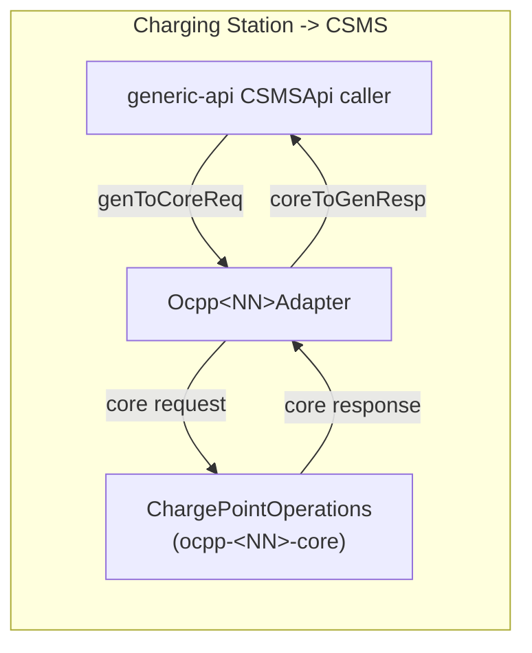
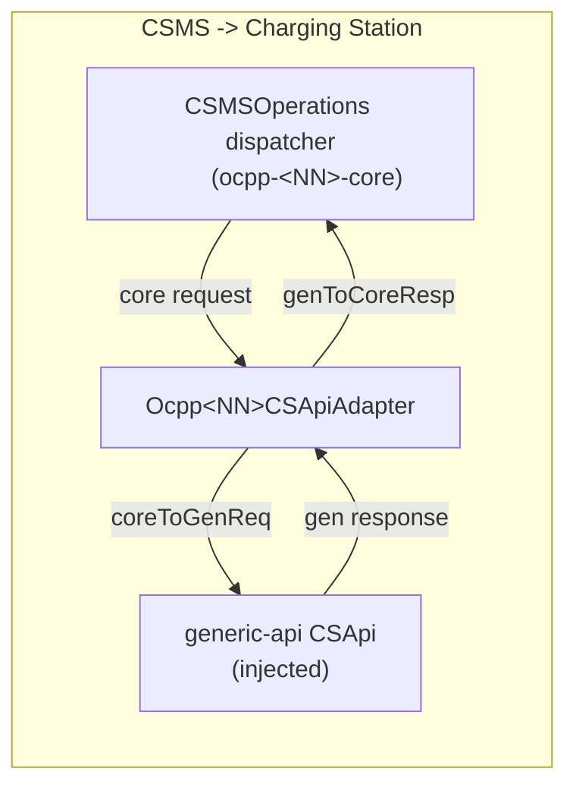

# api-adapter Layer Guidelines

## Purpose

The `api-adapter` layer is the pivot of the ocpp-toolkit design: it bridges the version-agnostic `generic-api`
model (`CSApi` / `CSMSApi`, the "gen" types) to a specific OCPP version's `ocpp-<X>-core` model (the "core"
types), in **both directions**, using MapStruct. Two instances are implemented:

- `ocpp-1-6-api-adapter`
- `ocpp-2-0-api-adapter`

A third, `ocpp-1-5-api-adapter`, is declared in `settings.gradle.kts` and `api(...)`'d by `toolkit`
but ships **no sources**, which is why `ApiFactory.getCSMSApi` throws `NotImplementedError` for
`OCPP_1_5`. The conventions below are what a new instance is expected to follow.

Everything above this layer (application code, transports) programs against the generic model only; everything
below it (`ocpp-<X>-core`, `ocpp-<X>-json`/`-soap`) is version-specific wire/protocol code that never needs to
know about `generic-api`. The adapter is the only place these two worlds meet.

## The Bidirectional Adapter Pair

Each instance exposes exactly two adapter classes covering opposite directions:





- **`Ocpp<NN>Adapter`** implements the generic `CSMSApi` interface. It is the outbound/Charging-Station-initiated
  direction: a generic request comes in, gets mapped `genToCoreReq`, is sent through
  `ChargePointOperations.newChargePointOperations(...)` (which wraps a `ClientTransport`), and the core response
  is mapped back `coreToGenResp`. It constructs its own `Ocpp<NN>CSApiAdapter` internally to handle the reverse
  direction of dispatched incoming calls.
- **`Ocpp<NN>CSApiAdapter`** implements the version's core `CSMSOperations` interface (the dispatch target for
  CSMS-initiated calls arriving over the wire). It is the inbound direction: a core request is mapped
  `coreToGenReq`, forwarded to an injected generic `CSApi`, and the generic response is mapped back
  `genToCoreResp`.

Every operation method returns `OperationExecution<Req, Resp>`, combining the mapped payload with an
`ExecutionMetadata` (holding `RequestMetadata` plus a `RequestStatus`: `SUCCESS`, `NOT_SEND`, etc.). In
`Ocpp<NN>Adapter`, `response.executionMeta` from the core operation is propagated as-is. In
`Ocpp<NN>CSApiAdapter`, the wrapping is normally built fresh as `ExecutionMetadata(meta, RequestStatus.SUCCESS)`
since the `CSApi` call itself has already succeeded synchronously by the time a response exists.

## MapStruct Conventions

- **One mapper class per operation**, in a `mapper/` package: `<Operation>Mapper.kt` (e.g.
  `HeartbeatMapper.kt`, `StartTransactionMapper.kt`), plus a shared `CommonMapper.kt` for conversions reused
  across multiple operation mappers (id token handling, meter-value filtering, enum coercions shared by several
  operations).
- Every mapper is annotated `@Mapper(unmappedTargetPolicy = ReportingPolicy.IGNORE)`. Add
  `uses = [CommonMapper::class]` when the mapper needs a shared conversion from `CommonMapper`.
- Mappers that are pure field-for-field translations can be a Kotlin `interface`; mappers that need custom
  composition (manual response assembly, `@Named` qualifiers for nested lists/enums, stateful helpers like
  `isSupported`) are `abstract class`es. Both shapes appear across instances — pick whichever the mapper's logic
  requires.
- Method naming follows the direction the mapper is used in: `genToCoreReq`/`coreToGenResp` for mappers wired
  into `Ocpp<NN>Adapter`, `coreToGenReq`/`genToCoreResp` for mappers wired into `Ocpp<NN>CSApiAdapter`. Some
  mappers expose both pairs (e.g. when a `StatusNotification`-shaped mapper is reused for a synthesized call from
  the other direction) — keep the method names paired even if only one direction is currently exercised, so the
  mapper stays reusable.
- Enum/nested-object conversions that need custom logic are `@Named("convertX")` functions, referenced from a
  field mapping via `@Mapping(target = "...", source = "...", qualifiedByName = ["convertX"])`. List-of-nested
  conversions are typically a `@Named` singular converter plus a `@Named` list converter that `.map { }`s it.
- MapStruct generates its implementation via annotation processing: the `kotlin("kapt")` Gradle plugin must be
  applied, with `implementation("org.mapstruct:mapstruct:_")` and `kapt("org.mapstruct:mapstruct-processor:_")`
  declared (see any instance's `build.gradle.kts`). No version numbers are pinned per-module — they come from the
  root dependency catalog/version plugin.
- Adapters obtain a mapper instance locally, per call, via `Mappers.getMapper(<Operation>Mapper::class.java)`
  (MapStruct's generated-singleton factory) rather than injecting mappers through a constructor. Follow this
  existing pattern for new operations rather than introducing a different instantiation style.

## The "Unsupported" Protocol — Two Distinct Signals

A new mapper/operation must use the correct one of two mechanisms, and they are **not interchangeable**:

### 1. Whole operation absent from this OCPP version

If the generic operation has no protocol counterpart at all in this version (common, since `generic-api`'s
surface targets the union of all supported versions — most 2.0.1-era operations like `notifyReport`,
`dataTransfer`'s newer variants, `signCertificate`, etc. simply don't exist pre-2.0), the adapter method throws
immediately, before any mapper runs:

```kotlin
override fun notifyReport(...): OperationExecution<...> {
    throw IllegalStateException("NotifyReport can't be call in OCPP 1.6")
}
```

This is a fatal, caller-visible failure — there is no reasonable protocol equivalent to fall back to. Match the
existing message wording (`"<Operation> can't be call in OCPP <version>"`) for consistency; this is boilerplate,
not something worth "fixing" into a friendlier message.

### 2. Individual enum value absent within an otherwise-supported operation

If the operation exists in this version but the generic enum has values with no counterpart in the target enum
(e.g. transient firmware/log states not modeled by an older version), use the non-fatal two-tier pattern instead:

1. The mapper exposes a public `isSupported(status: XEnumType): Boolean`, typically backed by a private
   `unsupportedStatuses`/`unsupportedX` set.
2. The mapper's `@Named` conversion function is still an **exhaustive** `when` over every generic enum value,
   including the unsupported ones — those branches `throw IllegalArgumentException(...)` as a defensive
   "should never be reached" invariant, since the caller is expected to have already filtered with `isSupported`.
3. The adapter calls `isSupported(...)` **before** invoking the mapper. On `false`, it logs a warning and returns
   early with `OperationExecution(ExecutionMetadata(meta, RequestStatus.NOT_SEND), request, <EmptyResp>())` —
   this is a non-fatal, silently-dropped-and-logged outcome, not an exception.

```kotlin
if (!mapper.isSupported(request.status)) {
    logger.warn("FirmwareStatus ${request.status} has no equivalent in this OCPP version, notification ignored")
    return OperationExecution(ExecutionMetadata(meta, RequestStatus.NOT_SEND), request, FirmwareStatusNotificationResp())
}
```

**Maintenance hazard**: the `unsupportedStatuses` set (used by `isSupported`) and the throwing branches in the
`when` cover the *same* enum values by construction. Nothing enforces this at compile time beyond the `when`
being exhaustive over the enum — if you add a new enum value to `generic-api` that this version doesn't support,
you must update **both** the set and the `when` branch together, or the two will silently drift out of sync
(the `when` will fail to compile if you forget it there, since Kotlin enforces exhaustiveness, but nothing
forces you to add it to `unsupportedStatuses`, so a value could throw `IllegalArgumentException` at runtime
despite never being pre-filtered by `isSupported`). Treat these two lists as one unit whenever you touch either.

## Stateful Transaction-ID Correlation

The 1.x adapters (1.2, 1.5, 1.6) are **not** pure stateless mappers: OCPP versions before 2.0.1 identify a
transaction by a CSMS-assigned `Int` (`transactionId`, known only after `StartTransaction.conf`), while
`generic-api` (aligned with 2.0.1) identifies a transaction by an opaque `String` local id chosen by the
Charging Station and present from the very first `TransactionEventReq(eventType = Started)`. Each of these three
adapters carries a `TransactionRepository` to bridge the two id spaces:

- `Ocpp<NN>TransactionIds(localId: String, csmsId: Int)` — the correlation record.
- `TransactionRepository` interface: `saveTransactionIds(ids)`, `getTransactionIdsByLocalId(id)` (throws
  `IllegalStateException` if unknown), `getLocalIdByTransactionId(transactionId)` (nullable — returns `null`
  rather than throwing).
- `impl/RealTransactionRepository` — the default/only implementation, an in-memory
  `ConcurrentHashMap<String, Int>` keyed by local id (reverse lookup by CSMS id is a linear scan). It must be the
  **same instance** shared between `Ocpp<NN>Adapter` and its internally-constructed `Ocpp<NN>CSApiAdapter`, so an
  id saved when a transaction starts is visible to later CSMS-initiated operations (e.g. `RemoteStopTransaction`,
  `SetChargingProfile`) on the same transaction.

**The OCPP 2.0.1 adapter does not need this machinery** — `generic-api` already models the unified
`TransactionEventReq/Resp` shape 2.0.1 uses natively, so there is no id-space mismatch to bridge.

Where the correlation is consumed:
- On `Started`: save the mapping after a successful `StartTransaction` (`localId -> csmsId` from the response).
- On `Ended`/meter values: resolve `csmsId` from the local id before calling the core operation.
- On CSMS-initiated calls referencing a transaction (`RemoteStopTransaction`, `SetChargingProfile`): resolve the
  local id from the CSMS-supplied int id, going the other direction.

Because this is a plain in-memory map with no eviction, entries accumulate for the adapter's lifetime; a
transaction whose `Started` event was never seen by this adapter instance has no mapping, and lookups going
through `getTransactionIdsByLocalId` will throw. Callers must decide per-operation whether that is fatal (let it
propagate) or should degrade gracefully (see below) — do not add eviction/TTL logic without checking all
existing call sites that rely on entries staying resolvable for the lifetime of a transaction.

## Lossy and Asymmetric Mappings: When to Throw, Degrade, or Synthesize

The two model shapes are not always 1:1 (most pronounced for the 1.x versions; OCPP 2.0.1 mapping is comparatively
close to a faithful field-for-field translation since `generic-api` already mirrors its shapes). Pick the right
failure mode deliberately:

- **Throw (`IllegalStateException`/`IllegalArgumentException`)** when the mismatch reflects a hard protocol
  limitation with no sane fallback — e.g. a measurand/enum value the target version's model cannot represent at
  all, or a meter-value list that doesn't reduce to exactly the single sample a legacy field requires. This
  should be the default for "the target protocol simply cannot express this."
- **Degrade to `RequestStatus.NOT_SEND`** when the situation is expected to occur in normal operation and
  discarding the message (with a logged warning) is an acceptable, non-fatal outcome. Besides the
  `isSupported`-gated enum case above, this shape is also used for meter values whose owning transaction id isn't
  (yet) in `TransactionRepository`: the call is wrapped in `try { ... } catch (e: IllegalStateException)`,
  logging and returning `NOT_SEND` rather than propagating, since meter values may legitimately arrive slightly
  out of order relative to a transaction start.
- **Synthesize an extra message** when one generic operation logically implies a second core-side call that has
  no combined representation in the target version — most notably `transactionEvent`'s `chargingState` field
  triggering an additional `StatusNotification` call after `startTransaction`/`stopTransaction`, with its
  timestamp bumped by 1ms to guarantee ordering relative to the primary message. Combine the resulting
  `ExecutionMetadata` (`.combine(...)`) rather than discarding it, so the caller can see both outcomes.
- **Generate a synthetic id** when the target version's request shape requires a field the generic request
  doesn't supply and no meaningful correlation exists yet (e.g. a random `remoteStartId`/`remoteStartTransaction`
  int) — acceptable only when the target protocol doesn't actually use the value for correlation elsewhere.

`transactionEvent` itself fans out by `TransactionEventEnumType` (`Started` / `Updated` / `Ended`) to distinct
per-phase private methods (`startTransactionEvent` / `updateTransactionEvent` / `stopTransactionEvent`), each
invoking a different core operation — this fan-out is itself a form of lossy/asymmetric mapping (one generic
operation, several core operations) and is the standard shape for versions predating the unified
transaction-event model.

Also expect **deliberate name mismatches** between the generic and legacy operation names for versions where
`generic-api` uses its later (2.0.1-style) naming even though the target core interface kept the legacy name
(e.g. a generic `changeConfiguration` call may be implemented by calling a differently-named legacy `CSApi`
method, or `getDiagnostics` by calling a `getLog`-style method). This is intentional, not a bug — do not rename
generic-api method calls to "fix" an apparent mismatch without checking the corresponding per-version CLAUDE.md.

## Adding a New Operation Mapper — Checklist

1. **Confirm the operation exists in this OCPP version's core model** (check the version's
   `ChargePointOperations`/`CSMSOperations` interfaces). If it does not exist at all, skip mapper creation and
   add a `throw IllegalStateException("<Operation> can't be call in OCPP <version>")` override directly in
   `Ocpp<NN>Adapter`, matching the existing message wording.
2. **Create `mapper/<Operation>Mapper.kt`** following the existing `@Mapper(unmappedTargetPolicy =
   ReportingPolicy.IGNORE)` pattern, adding `uses = [CommonMapper::class]` if you need a shared conversion.
   Prefer reusing `CommonMapper` helpers (meter values, measurands, id tokens) over re-implementing them.
3. **If the generic enum has values with no target-version equivalent**, add both an `isSupported(...)` guard
   (backed by an explicit "unsupported" set) and a matching exhaustive-`when` `throw` branch in the `@Named`
   conversion — see the two-tier protocol above. Update both together.
4. **Wire the mapper into the correct adapter and direction**: `Ocpp<NN>Adapter` (`genToCoreReq`/`coreToGenResp`)
   for Charging-Station-initiated operations, `Ocpp<NN>CSApiAdapter` (`coreToGenReq`/`genToCoreResp`) for
   CSMS-initiated operations. Instantiate via `Mappers.getMapper(<Operation>Mapper::class.java)` inside the
   adapter method, and wrap the result in `OperationExecution`/`ExecutionMetadata` following neighboring methods
   in the same file.
5. **If the operation involves a transaction id** (1.x adapters only), go through `TransactionRepository` for
   the local-id/CSMS-id correlation rather than passing a raw id through — extend the interface if you need a new
   lookup shape, don't reach into `RealTransactionRepository`'s map directly.
6. **Decide the failure mode deliberately**: throw for hard protocol impossibilities, degrade to `NOT_SEND` for
   expected-but-unmappable situations, synthesize an extra call only when the target protocol genuinely needs a
   second message to express the same generic event.
7. **Add test coverage** (see below) in `MapperTest.kt` for the mapper itself, and `AdapterTest.kt` /
   `CSApiAdapterTest.kt` for the adapter wiring, including the unsupported/`NOT_SEND` path if applicable.

## Test Conventions

Each instance's `src/test/kotlin/.../test/` package follows the same three-file split:

- **`AdapterTest.kt`** — exercises `Ocpp<NN>Adapter` end-to-end (Charging-Station-initiated direction) against a
  mocked `ChargePointOperations`/transport (MockK), asserting full generic-to-core-and-back translation plus
  transaction-id correlation side effects where applicable.
- **`CSApiAdapterTest.kt`** — exercises `Ocpp<NN>CSApiAdapter` end-to-end (CSMS-initiated direction) against a
  mocked generic `CSApi`.
- **`MapperTest.kt`** — unit-tests individual MapStruct mappers directly via
  `Mappers.getMapper(<Operation>Mapper::class.java)`, asserting field-level round-trip mapping with Strikt,
  including `isSupported`/unsupported-enum-value branches where the mapper has them.

Every instance declares `testImplementation(testFixtures(project(":generic-api")))` and uses the shared
`generic-api` testFixtures builders (e.g. `transactionEventReq(...)`) to construct realistic generic request
objects rather than hand-building every field — prefer these builders over duplicating construction logic when
writing new tests.

## Domain-Specific Variations

Each version's specific unsupported-operation list, enum mapping tables, transaction fan-out details, and any
version-only quirks are documented in that instance's own CLAUDE.md — this file intentionally does not
duplicate them:

- [ocpp-1-6-api-adapter/](../ocpp-1-6-api-adapter/CLAUDE.md) — full transaction-id state machine detail, stop-
  reason collapsing, unconditional `RequestStatus.SUCCESS` in `Ocpp16CSApiAdapter`.
- [ocpp-2-0-api-adapter/](../ocpp-2-0-api-adapter/CLAUDE.md) — near-1:1 mapping, device-model report nesting,
  cross-field business validation living in the adapter rather than the mapper.
