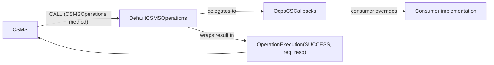

# API Layer Guidelines

## Purpose

The `api` layer turns charging-station-side implementation into an opt-in exercise. For each
OCPP version, it provides the glue between a version's `core` model/operation contracts and a
consumer who wants to *simulate or implement a charging station*: implement only the callbacks
you care about, and get a working `CSMSOperations` for free.

Instances: `ocpp-1-5-api`, `ocpp-1-6-api`, `ocpp-2-0-api` — one per protocol version, each
depending only on its matching `core` module and `operation-information`. `ocpp-1-6-security`
follows the same shape for the 1.6 Security Whitepaper operations.



## Common Patterns

Every instance has exactly the same two-file shape and the same wiring:

- **Opt-in callbacks.** `OcppCSCallbacks` is an interface where every method's default body is
  `throw NotImplementedError()`. There is no capability negotiation or registry — a consumer
  overrides only the operations it supports, and an unimplemented operation throws at call time
  rather than failing to compile or silently no-op'ing.
- **Uniform delegation body.** Every override in `DefaultCSMSOperations` has the identical shape:

  ```kotlin
  OperationExecution(
      ExecutionMetadata(meta, RequestStatus.SUCCESS, now()),
      req,
      ocppCSCallbacks.<operation>(req)
  )
  ```

- **`RequestStatus.SUCCESS` is hardcoded.** The metadata reports success the instant the
  callback returns a value. There is no code path that produces `RequestStatus.FAILED` from
  this layer — a failing callback throws an exception instead. Anything needing richer status
  semantics (partial failure, retries, etc.) must be implemented by the callback itself or by
  a caller wrapping the operation.
- **Timestamp is response time, not receipt time.** `kotlin.time.Clock.System.now()` is
  captured at delegation time, i.e. when the callback returns — not when the request arrived.
- **CSMS-to-charging-station direction only.** This layer implements `CSMSOperations`, i.e. the
  operations a CSMS sends to a charging station. The reverse direction (charging-station-to-CSMS
  calls, e.g. `BootNotification`, `StatusNotification`) goes through the version's `core`
  `ChargePointOperations` and is wired up separately by `toolkit`'s `ApiFactory`. This layer has
  no involvement in that direction.

## Naming Conventions

- **Package**: `com.izivia.ocpp.api<NN>` (e.g. `com.izivia.ocpp.api16`)
- **Files/Types**: exactly two per module, both fixed names — `OcppCSCallbacks` and
  `DefaultCSMSOperations` (no per-operation files)
- **Callback methods**: same name/shape as the corresponding `CSMSOperations` method in `core`,
  taking the Req type and returning the Resp type
- **Module name**: `ocpp-<version>-api` (e.g. `ocpp-1-6-api`)

## File Organization

```
ocpp-<version>-api/
└── src/main/kotlin/com/izivia/ocpp/api<NN>/
    ├── OcppCSCallbacks.kt        # consumer-implemented interface, all defaults throw
    └── DefaultCSMSOperations.kt  # implements core<NN>.CSMSOperations, delegates to callbacks
```

Two files only — there is no sub-packaging by operation. Keeping both types in one flat package
makes the lockstep relationship between them easy to audit by reading a single directory.

## The CSMSOperations / OcppCSCallbacks / DefaultCSMSOperations Lockstep

These three types must always move together and stay in sync:

1. `CSMSOperations` (in `core`) declares the CSMS-initiated operation set for the version.
2. `OcppCSCallbacks` (in `api`) declares one default-`NotImplementedError` method per
   `CSMSOperations` method.
3. `DefaultCSMSOperations` (in `api`) implements `CSMSOperations` by delegating each method to
   the matching `OcppCSCallbacks` method, using the uniform delegation body above.

Adding an operation to `CSMSOperations` without adding the matching callback and delegation
breaks compilation of `DefaultCSMSOperations` — this is by design, it is the mechanism that
keeps the three in lockstep.

## Adding an Operation

1. Add the Req/Resp model and the method on `CSMSOperations` in the matching `core` module.
2. Add the callback to `OcppCSCallbacks` with a `throw NotImplementedError()` default.
3. Add the delegating override to `DefaultCSMSOperations` using the uniform delegation body.
4. Update the matching mapper in the version's `api-adapter` module so the generic API can
   reach the new operation.
5. Verify the module still compiles — a missing callback or delegation fails the build.

## Common Dependencies

- **`operation-information`**: supplies `OperationExecution`, `ExecutionMetadata`,
  `RequestStatus` — the envelope every delegated call is wrapped in.
- **`kotlin.time`** (stdlib): `Clock.System.now()` for the response timestamp.
- The matching `core<NN>` module: supplies `CSMSOperations` and all Req/Resp models.

## Callback Count as a Version-Coverage Proxy

The number of methods on `OcppCSCallbacks` tracks how much of a version's CSMS-initiated
operation set is modeled, and grows with each protocol version:

| Version | Callbacks |
|---------|-----------|
| 1.2     | 9         |
| 1.5     | 15        |
| 1.6     | 19        |
| 2.0.1   | 40        |

A callback count lower than the number of operations in that version's `core` `CSMSOperations`
signals a lockstep break, not a legitimate gap — the two are meant to always match exactly.

## Domain-Specific Variations

Each version's `api` module follows the exact shape above with no structural variation; the
differences are limited to the operation set and callback count for that version. See:
- [../ocpp-1-5-api/CLAUDE.md](../ocpp-1-5-api/CLAUDE.md)
- [../ocpp-1-6-api/CLAUDE.md](../ocpp-1-6-api/CLAUDE.md)
- [../ocpp-2-0-api/CLAUDE.md](../ocpp-2-0-api/CLAUDE.md)
