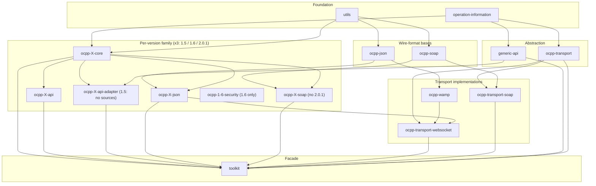
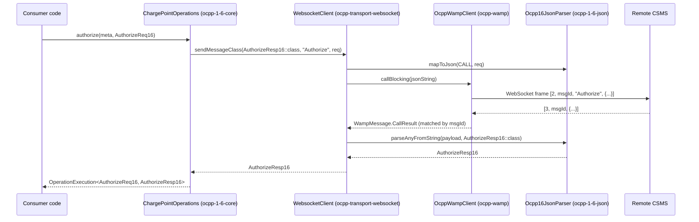
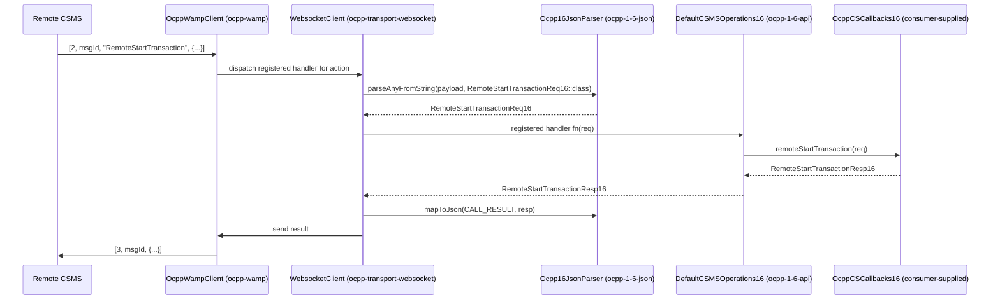

# Architecture

## Overview

`ocpp-toolkit` is a Kotlin/JVM library (Gradle multi-module monorepo, published to Maven Central
under the `com.izivia` group) that implements the OCPP (Open Charge Point Protocol) wire protocol
for both roles that talk to each other in EV charging — the CSMS (Central System / back office) and
the Charging Station — across three protocol versions (1.5, 1.6, 2.0.1) and two wire formats
(OCPP-J over WebSocket/JSON, and OCPP-S over SOAP/HTTP for the 1.x versions). It is explicitly
**not** a charging-station simulator or a CSMS product: it is a strict protocol implementation with
**no business logic** — request/response models, action dispatch, (de)serialization, schema
validation, and transport plumbing only. Consumers embed it to simulate a charge point, simulate a
CSMS, or implement either side of a real integration, and own all business logic themselves. Per the
root `README.md`, the Charging-Station side of 1.6 and 2.0.1 over OCPP-J is the most complete/tested
path; CSMS-side, OCPP 1.5, and SOAP are less complete; TLS/mutual-certificate handling is explicitly
out of scope (delegated to a proxy such as Envoy), while HTTP Basic Auth is supported directly.

## System Diagram

The repository has 25 modules plus `buildSrc`. Four of them (`ocpp-X-core`, `ocpp-X-api`, `ocpp-X-api-adapter`, and
the JSON/SOAP parser modules) are near-identical repeated "layers", one instance per OCPP version —
see [layer x version matrix](#layer-x-version-matrix) below. To keep the graph readable, the diagram
collapses those four version families into a single representative "per-version family" lane; the
[Module Structure](#module-structure) section lists every concrete module.

`toolkit` is the only module a typical consumer depends on directly: it declares an `api(project(...))`
dependency on every other module so all three OCPP versions, both wire formats, and the generic API are
transitively available from one artifact.

## Layer x Version Matrix

The single most load-bearing fact about this repo's shape is *which (version, layer) combinations
exist*, because the gaps are meaningful rather than accidental:

| Version | `-core` | `-api` | `-api-adapter` | `-json` (OCPP-J) | `-soap` (OCPP-S) |
|---------|:-------:|:------:|:---------------:|:-----------------:|:------------------:|
| 1.5     | ✅ | ✅ | ⚠️ *(module declared, no sources)* | ✅ | ✅ |
| 1.6     | ✅ | ✅ | ✅ | ✅ | ✅ |
| 2.0.1   | ✅ | ✅ | ✅ | ✅ | ❌ *(2.0.1 has no SOAP binding; no `ocpp-2-0-soap` module)* |

Two consequences follow directly from this table:

- **The generic API is unavailable for 1.5.** `ocpp-1-5-api-adapter` is in `settings.gradle.kts`
  and `api(...)`'d by `toolkit`, but has no `src/`, so `ApiFactory.getCSMSApi` throws
  `NotImplementedError("Ocpp 1.5 api adapted not yet implemented")` for `OCPP_1_5`. The version's
  *typed* API (`ocpp-1-5-api` + `ocpp-1-5-core`) works fine — only the version-agnostic path is
  missing.
- **There is no `ocpp-2-0-soap`** for `ocpp-transport-soap`/`toolkit` to wire up; `ApiFactory`'s
  private `getSoapParser` falls through to `TODO("Not yet implemented")` for `OCPP_2_0`.

Outside the matrix, [ocpp-1-6-security](../ocpp-1-6-security/CLAUDE.md) carries the OCPP 1.6
Security Whitepaper operations as a separately published, opt-in module. See also
[ocpp-transport-websocket/CLAUDE.md](../ocpp-transport-websocket/CLAUDE.md).

## Module Structure

**Foundation** (no, or minimal, project dependencies — consumed by nearly everything):
- [operation-information/](../operation-information/CLAUDE.md) — dependency-free shared vocabulary: `RequestMetadata`, `ExecutionMetadata`, `OperationExecution<T,R>`, `RequestStatus` ("worst status wins" combine), `ActionOcpp`, `CSMSCallbacks`/`CSCallbacks` marker interfaces, `ChargingStationConfig`.
- [utils/](../utils/CLAUDE.md) — published as `ocpp-utils`: `MessageErrorCode`, the `OcppParserException` hierarchy, `kotlin.time.Instant` Jackson (de)serializers, rule-based JSON field-coercion helpers (`Commons.kt`), `Fault`.
- [buildSrc/](../buildSrc) — Gradle convention functions (`kotlinProject()`, `coreProject()`) shared by every module's `build.gradle.kts`.

**Abstraction**:
- [ocpp-transport/](../ocpp-transport/CLAUDE.md) — the version-agnostic `ClientTransport`/`ServerTransport` contracts, `OcppVersion`, `RequestHeader(s)`, `OcppCallErrorException`/`Payload`.
- [generic-api/](../generic-api/CLAUDE.md) — the version-agnostic API (`CSApi`/`CSMSApi` role facades, per-operation `model/` packages, `impl/DefaultCSMSApi`); the mapping target for every `-api-adapter` module.

**Wire-format bases**:
- [ocpp-json/](../ocpp-json/CLAUDE.md) — the shared OCPP-J envelope model, parse/validate/serialize pipeline (`OcppJsonParser`), and schema validator; not itself a version instance.
- [ocpp-soap/](../ocpp-soap/CLAUDE.md) — the shared OCPP-S envelope model (asymmetric read/write DTOs), fault model, and Jackson-XML mapper config; not itself a version instance.

**Per-version families** (one instance of each layer per version — see the matrix above; the shared
conventions for each layer live in `docs/CORE.guidelines.md`, `docs/API.guidelines.md`,
`docs/API-ADAPTER.guidelines.md`, `docs/JSON.guidelines.md`, `docs/SOAP.guidelines.md`):
- core: [ocpp-1-5-core](../ocpp-1-5-core/CLAUDE.md), [ocpp-1-6-core](../ocpp-1-6-core/CLAUDE.md), [ocpp-2-0-core](../ocpp-2-0-core/CLAUDE.md) — protocol model, `CSMSOperations`/`ChargePointOperations`, the `Actions` registry, `DeserializeOptions`.
- api: [ocpp-1-5-api](../ocpp-1-5-api/CLAUDE.md), [ocpp-1-6-api](../ocpp-1-6-api/CLAUDE.md), [ocpp-2-0-api](../ocpp-2-0-api/CLAUDE.md) — `OcppCSCallbacks` (opt-in, `NotImplementedError` defaults) + `DefaultCSMSOperations`.
- api-adapter: [ocpp-1-6-api-adapter](../ocpp-1-6-api-adapter/CLAUDE.md), [ocpp-2-0-api-adapter](../ocpp-2-0-api-adapter/CLAUDE.md) — MapStruct bridge both ways between `generic-api` and that version's core; stateful (transaction-id correlation). `ocpp-1-5-api-adapter` is declared but empty.
- json: [ocpp-1-5-json](../ocpp-1-5-json/CLAUDE.md), [ocpp-1-6-json](../ocpp-1-6-json/CLAUDE.md), [ocpp-2-0-json](../ocpp-2-0-json/CLAUDE.md).
- soap: [ocpp-1-5-soap](../ocpp-1-5-soap/CLAUDE.md), [ocpp-1-6-soap](../ocpp-1-6-soap/CLAUDE.md) — no `ocpp-2-0-soap`.
- security (1.6 only): [ocpp-1-6-security](../ocpp-1-6-security/CLAUDE.md) — the Security Whitepaper operation interfaces, wired by `toolkit` as an independent facet.

**Transport implementations**:
- [ocpp-wamp/](../ocpp-wamp/CLAUDE.md) — OCPP-J WAMP-like framing, OkHttp client, Undertow/http4k server, single-in-flight-call-per-connection manager, auto-reconnect with exponential backoff.
- [ocpp-transport-websocket/](../ocpp-transport-websocket/CLAUDE.md) — implements `ClientTransport`/`ServerTransport` over `ocpp-wamp`; the single per-version JSON parser dispatch point.
- [ocpp-transport-soap/](../ocpp-transport-soap/CLAUDE.md) — implements `ClientTransport`/`ServerTransport` over HTTP (http4k + Undertow); the client is dual-role (also an embedded server) since SOAP has no duplex channel.

**Facade**:
- [toolkit/](../toolkit/CLAUDE.md) — the single artifact consumers depend on. Real entry points are `ApiFactory` companion functions (`ocpp12/15/16/20ConnectionToCSMS`, `getCSMSApi`, `csmsOcppServer`) and the `CSMS` class (groups per-port transports into one http4k/Undertow server, exposes `getCSApi12/15/16/20`/`getCSApiGeneric`).

## Data Flow

Both directions below use OCPP 1.6 over OCPP-J as the concrete example; the OCPP-S path differs only
in that each request/response is an independent HTTP POST correlated via WS-Addressing headers
instead of a persistent socket (see [ocpp-transport-soap/CLAUDE.md](../ocpp-transport-soap/CLAUDE.md)).

### Outbound: Charging Station -> CSMS

### Inbound: CSMS -> Charging Station

In both directions, `Ocpp16JsonParser`/`OcppJsonParser` never throws out of the parse pipeline: any
malformed input, schema-validation failure, or unknown action is normalized into a `CALL_ERROR`
`JsonMessage` wrapping a `Fault` payload — see [Cross-Cutting Design Decisions](#cross-cutting-design-decisions).

## The Generic-API Indirection

`generic-api` + one `ocpp-X-api-adapter` per version exist so a consumer can write code once against
`CSApi`/`CSMSApi` and swap the underlying OCPP version (1.6/2.0.1; 1.5 is not yet wired) without touching call
sites — `toolkit`'s `ApiFactory.getCSMSApi` picks the matching `Ocpp<Version>Adapter` purely off
`Settings.ocppVersion`. This buys version-transparent application code at the cost of a lossy
mapping layer: the README states plainly that "the generic API may not cover all aspects with high
fidelity," because the versions' designs diverge in ways no single model captures cleanly. Concrete
examples visible in the adapters:

- **Transaction identity mismatch**: OCPP 1.6 assigns transactions a CSMS-issued `Int`, only known
  after `StartTransaction.conf`, while the generic model (aligned with 2.0.1) uses a charge-point-
  chosen `String` id present from the first event. `ocpp-1-6-api-adapter`'s `RealTransactionRepository`
  exists solely to correlate the two — see [ocpp-1-6-api-adapter/CLAUDE.md](../ocpp-1-6-api-adapter/CLAUDE.md).
- **Operations with no equivalent**: generic operations such as `notifyReport`, `notifyEvent`, or
  `signCertificate` simply `throw IllegalStateException("<Operation> can't be call in OCPP 1.6")` in
  `Ocpp16Adapter` when OCPP 1.6 has nothing corresponding.
- **Field-shape mismatches**: `CommonMapper.filterMeterValues` must derive 1.6's plain `Int`
  `meterStart`/`meterStop` from exactly one matching `EnergyActiveImportRegister` sample in the
  generic model's list of sampled values, throwing if zero or more than one match — a structurally
  lossy reduction in one direction.

Consumers that need full-fidelity access to a specific version's protocol surface should use that
version's `-core`/`-api` modules directly instead of the generic API.

## Cross-Cutting Design Decisions

- **Errors as values, not exceptions, at the parser boundary.** Both `OcppJsonParser.parseAnyFromString`
  ([ocpp-json/CLAUDE.md](../ocpp-json/CLAUDE.md)) and `OcppSoapParserImpl.parseAnyRequestFromSoap`/
  `parseAnyResponseFromSoap` ([ocpp-soap/CLAUDE.md](../ocpp-soap/CLAUDE.md)) catch all parsing/validation
  failures internally and return a normal result object (a `CALL_ERROR` `JsonMessage`/`Fault`, or a
  message carrying a `SoapFault` payload) rather than throwing. Callers always get back a well-formed
  message to route/log/answer, never an unhandled exception from the wire.
- **The per-version `Actions` enum is the universal dispatch table**, not the typed operation
  interfaces. Each `ocpp-X-core`'s `model/common/enumeration/Actions.kt` (an `IActions`) maps every
  wire action name to its `Req`/`Resp` classes and `OcppInitiator`, and this registry — not
  `CSMSOperations`/`ChargePointOperations` — is what the `-json`/`-soap` parser modules use for
  serialization/dispatch. This is why an operation can exist in the wire protocol before it has a
  convenience method anywhere (see [Known Gaps](#known-gaps-and-rough-edges)).
- **Stateful transaction-id correlation lives in the adapters, not the cores.** Every pure mapping
  step elsewhere in the toolkit is stateless; `ocpp-1-6-api-adapter`'s `TransactionRepository`
  is the deliberate, documented exception, because 1.x's CSMS-assigned `Int` transaction id can only
  be known after the fact.
- **Escape hatches for non-conforming peers.** Real-world charge points and CSMSs sometimes violate
  the spec (missing required fields, wrong field types). `utils`' `AbstractIgnoredNullRestriction`
  (default-value injection for missing fields) and `AbstractForcedFieldType` (type coercion) are
  wired per-version via each core's `DeserializeOptions.kt` and consumed by the `-json`/`-soap`
  parsers; `OcppJsonValidator`'s `ignoredValidationCodes` similarly downgrades specific schema
  violations from hard failures to warnings. All such fixups are recorded as `ErrorDetail` warnings
  on the returned message rather than silently swallowed.

## Known Gaps and Rough Edges

- **SOAP server cannot push unsolicited requests.** `OcppSoapServerTransport.sendMessageClass` is an
  explicit `TODO` — a CSMS built on `ocpp-transport-soap` can receive and answer Charging-Station-
  initiated calls, but cannot itself initiate a call (e.g. RemoteStartTransaction) to a charge point.
  See [ocpp-transport-soap/CLAUDE.md](../ocpp-transport-soap/CLAUDE.md).
- **OCPP 1.6 Security Whitepaper operations live outside the usual layer, and are opt-in.** Their
  models and `Actions.kt` entries are in `ocpp-1-6-core`, but the typed operations are *not* on that
  module's `CSMSOperations`/`ChargePointOperations` (nor on `ocpp-1-6-api`'s callback interfaces) —
  they are in the separate [ocpp-1-6-security](../ocpp-1-6-security/CLAUDE.md) module, as
  `SecurityCSMSOperations`/`SecurityChargePointOperations`. Two things follow: on the client side
  they are reachable only when `Settings.ocpp16SecurityExtensions` is `true`, and on the CSMS side
  the callback object must implement the security interface for `CSMS` to register that facet.
  Looking for `getLog` on `CSMSOperations` and concluding it is unimplemented is the easy mistake
  here.
- **The root README's usage examples are stale.** They reference class names like
  `Ocpp16ConnectionToCSMS`/`Ocpp20ConnectionToCSMS` that do not exist in the current code; the real
  entry points are the `ApiFactory.ocpp16ConnectionToCSMS`/`ocpp20ConnectionToCSMS` companion
  functions on `toolkit`'s `ApiFactory`. See [toolkit/CLAUDE.md](../toolkit/CLAUDE.md).
- **OCPP 1.5 has no working generic-API path.** `ocpp-1-5-api-adapter` exists as a Gradle module
  and is `api(...)`'d by `toolkit`, but ships no sources, so `ApiFactory.getCSMSApi` throws
  `NotImplementedError` for `OCPP_1_5`. Use the typed 1.5 API (`ocpp-1-5-api` + `ocpp-1-5-core`)
  until that module is filled in.
- **`OcppVersion` is duplicated.** `com.izivia.ocpp.transport.OcppVersion` (`ocpp-transport`) and
  `com.izivia.ocpp.OcppVersion` (`ocpp-wamp`) declare identical entries with no derivation between
  them, and `ocpp-transport-websocket` imports the `ocpp-wamp` one. Adding a protocol version to
  only one of them makes dispatch diverge silently between layers.
- **`ocpp-wamp` allows only one in-flight call per connection**, by design (mirroring OCPP's
  one-call-at-a-time rule): a second concurrent call busy-waits and then throws rather than queuing.
  Worth knowing before assuming request pipelining is possible. See [ocpp-wamp/CLAUDE.md](../ocpp-wamp/CLAUDE.md).

## Key Technologies

- **Kotlin/JVM** (JVM target 21, Kotlin 2.2 language/API level) as the sole implementation language;
  Gradle multi-module build with `refreshVersions` resolving dependency versions from
  `versions.properties` (see root `build.gradle.kts`, `settings.gradle.kts`, `gradle.properties`).
- **Jackson** (core + `jackson-module-kotlin` + `jackson-dataformat-xml`) for both OCPP-J JSON and
  OCPP-S XML (de)serialization, extended with a custom `kotlin.time.Instant` module (`utils`)
  since the codebase standardizes on the `kotlin.time` stdlib types rather than `java.time`.
- **networknt json-schema-validator** for validating OCPP-J payloads against the OCPP-provided JSON
  Schemas, one schema loaded lazily per action (`ocpp-json`'s `OcppJsonValidator`).
- **MapStruct** for the generated, compile-time-checked mappings between `generic-api` and each
  version's core model inside every `ocpp-X-api-adapter` module.
- **OkHttp** (WebSocket client) and **Undertow + http4k** (WebSocket/HTTP servers, and the SOAP
  client's embedded receiving server) as the concrete transport-level libraries underneath
  `ocpp-wamp`, `ocpp-transport-websocket`, and `ocpp-transport-soap`.
- **MockK** and **Strikt** in tests across the adapter/transport modules, per the module `CLAUDE.md` files.

## Where Do I Change X?

| I want to...                                                              | Start here |
|----------------------------------------------------------------------------|------------|
| Add a new OCPP operation to one version                                   | `ocpp-X-core/CLAUDE.md` (model + `Actions` registry), then `ocpp-X-api-adapter/CLAUDE.md` if it should be reachable via `generic-api`; see `docs/CORE.guidelines.md` |
| Add a new version-agnostic operation                                      | [generic-api/CLAUDE.md](../generic-api/CLAUDE.md) |
| Change JSON parsing/validation behavior                                   | [ocpp-json/CLAUDE.md](../ocpp-json/CLAUDE.md) (shared pipeline) + the relevant `ocpp-X-json/CLAUDE.md`; see `docs/JSON.guidelines.md` |
| Change SOAP envelope building/parsing or fault handling                   | [ocpp-soap/CLAUDE.md](../ocpp-soap/CLAUDE.md) + the relevant `ocpp-X-soap/CLAUDE.md`; see `docs/SOAP.guidelines.md` |
| Change WebSocket/WAMP framing, correlation, or reconnection               | [ocpp-wamp/CLAUDE.md](../ocpp-wamp/CLAUDE.md) |
| Change how a consumer opens a connection or runs a CSMS server            | [toolkit/CLAUDE.md](../toolkit/CLAUDE.md) (`ApiFactory`, `CSMS`) |
| Add a whole new OCPP version end to end                                   | [toolkit/CLAUDE.md](../toolkit/CLAUDE.md) ("Adding Support for a New OCPP Version Here") plus each layer's `Adding...` section and guideline doc |
| Add or adjust transaction-id correlation                                  | `ocpp-1-6-api-adapter/CLAUDE.md` |
| Tolerate a non-conforming real-world charge point/CSMS payload            | [utils/CLAUDE.md](../utils/CLAUDE.md) (`Commons.kt`) + the relevant `ocpp-X-core/DeserializeOptions.kt` |
| Understand shared vocabulary types (`RequestMetadata`, `OperationExecution`, etc.) | [operation-information/CLAUDE.md](../operation-information/CLAUDE.md) |
| Understand the version-agnostic transport contract                        | [ocpp-transport/CLAUDE.md](../ocpp-transport/CLAUDE.md) |
