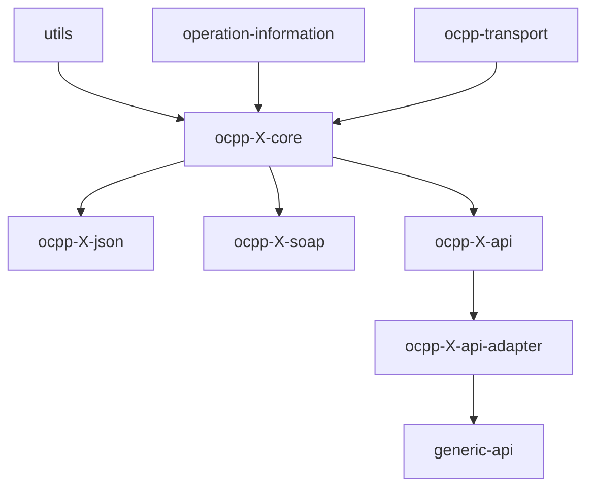

# Core Layer Guidelines

## Purpose

A `*-core` module owns the protocol contract for one OCPP version: the request/response
model, the action dispatch registry, and the two role interfaces (`CSMSOperations`,
`ChargePointOperations`) that describe what each side of an OCPP conversation can send and
receive. Three instances exist today — `ocpp-1-5-core`, `ocpp-1-6-core`, `ocpp-2-0-core` — one
per supported protocol version, each rooted at its own `com.izivia.ocpp.core<NN>` package.

**Boundary — what core explicitly does NOT do:**
- No wire format. No JSON annotations, no XML/SOAP envelope code, no Jackson config. Model
  classes stay transport-neutral so both `ocpp-X-json` and `ocpp-X-soap` (where both exist)
  can (de)serialize the same DTOs.
- No transport/networking. Socket, WebSocket and SOAP client/server plumbing lives in
  `ocpp-transport*`; `ChargePointOperations` only depends on `ClientTransport` as an
  injected collaborator, it does not implement it.
- No business logic. `impl/Real*Operations.kt` are thin dispatchers (build metadata, send
  through the injected transport, wrap the result) — not where domain rules live.
- No callback wiring. `CSMSCallbacks`/`CSCallbacks` (from `operation-information`) are empty
  marker interfaces at this layer; the actual incoming-message callback signatures are added
  by the matching `ocpp-X-api` module, not here.



Every core depends on exactly three project modules — `ocpp-transport`,
`operation-information`, `utils` — declared as plain `implementation(project(...))` in
`build.gradle.kts`. Downstream, each core is consumed by its matching `ocpp-X-json` and/or
`ocpp-X-soap` (wire format), `ocpp-X-api` (callback surface), and `ocpp-X-api-adapter`
(MapStruct bridge to `generic-api`).

## Common Patterns

- **`Request`/`Response` marker interfaces**: `model/Request.kt` and `model/Response.kt`
  each declare a single empty interface at the module's `model` root. Every `<Op>Req`
  implements `Request`, every `<Op>Resp` implements `Response`; nothing else is required of
  a payload class.
- **`Actions` registry**: `model/common/enumeration/Actions.kt` is an enum implementing
  `com.izivia.ocpp.utils.IActions`, one entry per OCPP action, each carrying the wire action
  string (`value`), `classRequest`/`classResponse` (`Req::class.java`/`Resp::class.java`),
  and `initiatedBy: OcppInitiator` (`CENTRAL_SYSTEM`, `CHARGING_STATION`, or `ALL` for
  bidirectional actions like `dataTransfer`).
- **`DeserializeOptions.kt`**: every core declares `Ocpp<NN>IgnoredNullRestriction`
  (extends `AbstractIgnoredNullRestriction`) and `Ocpp<NN>ForcedFieldType` (extends
  `AbstractForcedFieldType`), both from `com.izivia.ocpp.utils`, both keyed on the local
  `Actions` enum.
- **Two role interfaces + `impl/`**: `CSMSOperations` (extends `CSCallbacks`) and
  `ChargePointOperations` (extends `CSMSCallbacks`) declare one method per typed operation;
  `impl/RealCSMSOperations.kt` / `impl/RealChargePointOperations.kt` are the concrete
  dispatchers. `ChargePointOperations` additionally carries the `connect()`/`close()`
  lifecycle and a companion factory `newChargePointOperations(chargingStationId, transport,
  csmsOperations)` returning `RealChargePointOperations` — the entry point transport/SOAP
  consumers use to obtain a Charge-Point-side client.
- **`model/common/`**: cross-operation payload types and enumerations reused by several
  `Req`/`Resp` pairs (e.g. `IdTagInfo`, `MeterValue`) live in `model/common/`; a type used by
  only one operation's Req/Resp pair stays inside that operation's own package instead
  (e.g. `getconfiguration/KeyValue.kt`).
- **No project dependency beyond `ocpp-transport`, `operation-information`, `utils`.** Core
  modules never depend on a sibling core, on any `-json`/`-soap`/`-api`/`-api-adapter`
  module, or on `generic-api`.

## Naming Conventions

- **Root package**: `com.izivia.ocpp.core<NN>` (e.g. `core15`, `core16`, `core20`).
- **Operation packages**: `model/<operation>/` in lowercase, no separators (e.g.
  `changeavailability`, `getcompositeschedule`, `signedupdatefirmware`). The one observed
  exception is `ocpp-2-0-core`'s `model/certificateSigned/` (camelCase) — a known deviation
  from the convention, not a pattern to replicate.
- **Payload classes**: `<Operation>Req` / `<Operation>Resp`, PascalCase matching the action
  name (e.g. `ResetReq`, `GetCompositeScheduleResp`).
- **Enumerations**: nested under `model/<operation>/enumeration/` (operation-scoped) or
  `model/common/enumeration/` (shared), one enum type per file, named after the OCPP spec
  type (e.g. `AvailabilityStatus`, `ChargePointErrorCode`).
- **Actions registry entries**: enum constant is the upper-snake-case action name
  (`CHANGEAVAILABILITY`), `value` is the exact camelCase wire action string
  (`"changeAvailability"`) matching the OCPP spec.
- **DeserializeOptions classes**: `Ocpp<NN>IgnoredNullRestriction`, `Ocpp<NN>ForcedFieldType`
  — version number embedded in the class name.
- **impl classes**: `Real<Interface>` (e.g. `RealCSMSOperations`, `RealChargePointOperations`).

## File Organization

```
ocpp-X-core/
└── src/main/kotlin/com/izivia/ocpp/core<NN>/
    ├── CSMSOperations.kt              # CSMS-initiated operation contract
    ├── ChargePointOperations.kt       # Charge-Point-initiated operation contract + connect/close
    ├── DeserializeOptions.kt          # Ocpp<NN>IgnoredNullRestriction / Ocpp<NN>ForcedFieldType
    ├── impl/
    │   ├── RealCSMSOperations.kt
    │   └── RealChargePointOperations.kt
    └── model/
        ├── Request.kt                 # marker interface
        ├── Response.kt                # marker interface
        ├── common/                    # shared payload types + common/enumeration/
        │   └── enumeration/
        │       └── Actions.kt         # the dispatch registry
        └── <operation>/               # one package per OCPP action
            ├── <Operation>Req.kt
            ├── <Operation>Resp.kt
            └── enumeration/           # only if the operation introduces new enum types
```

Operations are organized one-package-per-action so that adding or removing an operation
touches a self-contained subtree; shared types are deliberately pulled up into `model/common/`
to avoid duplication across operations.

## Adding a New Operation

1. Confirm the operation is actually part of the target OCPP version's spec — do not port an
   operation from a sibling core (e.g. 1.6 into 1.5) without verifying it against the spec.
2. Create `model/<operation>/<Operation>Req.kt` and `<Operation>Resp.kt`, implementing
   `Request`/`Response` respectively; add `model/<operation>/enumeration/` if the operation
   introduces new enum types.
3. Register the operation in `model/common/enumeration/Actions.kt`: wire action string,
   `Req::class.java`/`Resp::class.java`, and `OcppInitiator`. **This step alone is what makes
   the operation dispatchable/serializable** by the downstream `-json`/`-soap` parsers — an
   operation with model classes but no `Actions` entry is invisible to them.
4. Add the corresponding method to `CSMSOperations` (if `OcppInitiator.CENTRAL_SYSTEM`) or
   `ChargePointOperations` (if `CHARGING_STATION`; add to both if `ALL`), and implement it in
   the matching `impl/Real*Operations.kt`.
5. If the payload has known interop quirks (missing-but-required fields, fields needing a
   forced type conversion), add an `Ocpp<NN>IgnoredNullRestriction`/`Ocpp<NN>ForcedFieldType`
   entry in `DeserializeOptions.kt` — only for concrete, observed interop issues, not
   speculatively.
6. Update every downstream module that must know about the new operation:
   - `ocpp-X-json` and/or `ocpp-X-soap` — wire (de)serialization for the new action.
   - `ocpp-X-api` — callback interface exposing the operation to library consumers.
   - `ocpp-X-api-adapter` — MapStruct mapping to/from `generic-api`.
7. Add/extend tests at the core level (Req/Resp round-trip, `Actions` lookup) and let the
   downstream modules' own test suites cover their part.

## Common Dependencies

- **`utils`**: `IActions`, `OcppInitiator`, `AbstractIgnoredNullRestriction`,
  `AbstractForcedFieldType`, `TypeConvertEnum`, `ActionTypeEnum`, `HasActionTimestamp`.
- **`operation-information`**: `RequestMetadata`, `OperationExecution<T, R>`,
  `ExecutionMetadata`, `RequestStatus`, `CSMSCallbacks`/`CSCallbacks` marker interfaces.
- **`ocpp-transport`**: `ClientTransport`/`ServerTransport` and related send/receive
  extension functions, used by `impl/Real*Operations.kt` and by
  `ChargePointOperations.newChargePointOperations(...)`.

## CSMS vs Charge Point Operations

- **`CSMSOperations`** (extends `CSCallbacks`) declares operations initiated by the CSMS
  (Central System) and executed against a Charging Station — e.g. `reset`,
  `changeAvailability`, `remoteStartTransaction`. Every method signature is
  `fun <op>(meta: RequestMetadata, req: <Op>Req): OperationExecution<<Op>Req, <Op>Resp>`.
- **`ChargePointOperations`** (extends `CSMSCallbacks`) declares operations initiated by the
  Charging Station toward the CSMS — e.g. `heartbeat`, `authorize`, `statusNotification` —
  plus the transport lifecycle `connect()`/`close()`. Methods follow the same
  `(meta, request) -> OperationExecution<Req, Resp>` shape and are typically annotated
  `@Throws(IllegalStateException::class, ConnectException::class)`.
- A bidirectional action (e.g. `dataTransfer`, tagged `OcppInitiator.ALL` in `Actions`)
  appears as a method on **both** interfaces.
- **`OperationExecution<T, R>` is the universal return type**: it pairs `executionMeta`
  (status + request/response timestamps) with the typed `request`/`response` payloads —
  every operation method on both interfaces returns it, regardless of role or OCPP version.

## Known Cross-Instance Divergences

- **Registry vs. typed interfaces can drift.** In `ocpp-1-6-core`, every Security Whitepaper
  extension operation (`getLog`, `deleteCertificate`, `installCertificate`,
  `certificateSigned`, `signCertificate`, `extendedTriggerMessage`, `signedUpdateFirmware`,
  etc.) has model classes and an `Actions` entry, but **no method** on `CSMSOperations` /
  `ChargePointOperations` — only the registry-based dispatch path reaches them. Before
  assuming an action is callable via the typed interface, check whether it actually has a
  method there.
- **Package-casing exception**: `ocpp-2-0-core`'s `certificateSigned` package breaks the
  lowercase-only convention followed by every other operation package across the cores.
- **Not every core has both wire bindings.** `ocpp-2-0-core` is OCPP-J only — there is no
  `ocpp-2-0-soap` — so a SOAP consumer does not exist for it. Check the matrix in
  `docs/ARCHITECTURE.md` before assuming a binding is there.
- **Operation set size varies enormously** (from the 1.5 core profile up to ~70 operation
  packages in 2.0.1) — never assume an operation existing in one core belongs in another;
  verify against the OCPP spec for that version, not against a sibling core.

## Domain-Specific Variations

Each version-specific core documents its own operation set, notable model differences, and
version-specific caveats:
- [../ocpp-1-5-core/CLAUDE.md](../ocpp-1-5-core/CLAUDE.md) — dual JSON/SOAP transport era
- [../ocpp-1-6-core/CLAUDE.md](../ocpp-1-6-core/CLAUDE.md) — Security Whitepaper extensions
- [../ocpp-2-0-core/CLAUDE.md](../ocpp-2-0-core/CLAUDE.md) — device model, TransactionEvent, ISO 15118
