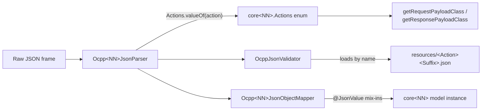

# JSON Layer Guidelines

## Purpose

The `json` layer implements OCPP-J (JSON over WebSocket) for a given protocol version: it binds
the shared parsing/validation machinery in `ocpp-json` to a version's `core` model, and ships the
official OCPP JSON schemas used to validate every payload on the wire.

Those schemas are the machine-readable protocol contract. To read them by field rather than by
file, generate the reference in [protocol/](protocol/README.md) and grep it.

Instances: `ocpp-1-5-json`, `ocpp-1-6-json`, `ocpp-2-0-json` — one per supported OCPP version.
OCPP-J is the only wire format for 2.0.1 (there is no `ocpp-2-0-soap`).



## Common Patterns

- **`Actions` enum is the single dispatch table.** All four version-specific hooks required by
  `OcppJsonParser` — `getRequestPayloadClass`, `getResponsePayloadClass`, `getActionFromClass`,
  `validateJson` — resolve through the version's `core<NN>.model.common.enumeration.Actions`
  enum, keyed by `Actions.valueOf(action.uppercase())`. An operation is unreachable over OCPP-J
  until it has an `Actions` entry.
- **Schema files are matched by name, not path.** `OcppJsonValidator` looks up
  `<Action><Suffix>.json` in `src/main/resources/`. A schema file whose name does not exactly
  match the expected `Actions`-derived name fails validation with a confusing "schema not
  found" error rather than a clear naming complaint — get the file name right.
- **A registered action with no schema file throws; it does not skip validation.** The lookup
  reaches `JsonSchemaFactory.getSchema(null)` and raises
  `IllegalArgumentException: argument "in" is null`, so the action is unusable over OCPP-J rather
  than merely unchecked. **`get15118EVCertificate` (2.0.1) is in this state today**: it has an
  `Actions` entry and model classes, but no `Get15118EVCertificateRequest.json` /
  `Get15118EVCertificateResponse.json`, and no test covers it. Both files *do* exist in OCA's
  official `OCPP-2.0.1_part3_JSON_schemas.zip`, so the fix is to copy them in. Adding an `Actions`
  entry always obliges you to add both schema files in the same change.
- **Do not edit a vendored schema to match a Kotlin model.** The schemas are the protocol contract;
  editing one makes validation agree with us and disagree with every conformant peer, and no test
  can catch it. This has already happened twice, in `ClearVariableMonitoring` (2.0.1):

  | Message | OCPP 2.0.1 | this repo |
  |---|---|---|
  | `ClearVariableMonitoringRequest` | `id` | `ids` |
  | `ClearVariableMonitoringResponse` | `clearMonitoringResult` | `clearMonitoringResults` |

  Both the shipped schema and the Kotlin property carry the plural name, so payloads round-trip
  internally and fail against a real peer. Verified by diffing all 126 vendored 2.0.1 schemas
  against OCA's `part3` zip: 124 differ only by the `$id` the project strips, and these two differ
  in field names. Part 2 Errata v1.0 does not rename them. Fixing this means renaming the Kotlin
  properties (a breaking API change) and restoring OCA's schema, so it needs a deliberate decision
  — see [protocol/SPECS.md](protocol/SPECS.md#two-verified-divergences-from-the-official-201-schemas).
- **Validation is opt-out, not opt-in.** The parser constructor takes
  `enableValidation: Boolean = true`; passing `false` drops the `OcppJsonValidator` entirely via
  `takeIf { enableValidation }`. Useful for talking to a non-conforming peer, at the cost of
  losing all schema checking.
- **Three escape hatches for non-conforming peers**, all forwarded to `OcppJsonParser`:
  - `ignoredNullRestrictions` — accept nulls the schema forbids
  - `forcedFieldTypes` — coerce a field's JSON type before mapping
  - `ignoredValidationCodes` — suppress specific `ValidatorTypeCode`s

  These are version-typed (e.g. `Ocpp16IgnoredNullRestriction`, `Ocpp16ForcedFieldType`) and
  come from the matching `core<NN>` module's `DeserializeOptions.kt`.
- **Enum `@JsonValue` mix-ins.** The object mapper attaches Jackson mix-ins so enums serialise
  to their wire `value` string rather than the Kotlin constant name. An enum whose wire form
  differs from its constant name needs a mix-in here to round-trip correctly.
- **`CALL_ERROR` messages skip validation.** `validateJson` returns early for error frames —
  only `CALL` and `CALL_RESULT` payloads are schema-checked.

## Naming Conventions

- **Package**: `com.izivia.ocpp.json<NN>` (e.g. `com.izivia.ocpp.json16`)
- **Parser class**: `Ocpp<NN>JsonParser`, extends `OcppJsonParser`
- **Mapper object**: `Ocpp<NN>JsonObjectMapper`, `internal object` extending `OcppJsonMapper`
- **Schema files**: `<Action><Suffix>.json` in `src/main/resources/` (suffix conventions differ
  by version — see below)
- **Module name**: `ocpp-<version>-json` (e.g. `ocpp-1-6-json`)

## File Organization

```
ocpp-<version>-json/
├── src/main/kotlin/com/izivia/ocpp/json<NN>/
│   ├── Ocpp<NN>JsonParser.kt        # extends OcppJsonParser, 4 hooks
│   └── Ocpp<NN>JsonObjectMapper.kt  # internal object, Jackson mix-ins
├── src/main/resources/              # official OCPP JSON schemas, one file per Req/Resp
└── src/test/kotlin/com/izivia/ocpp/json<NN>/
    └── JsonSchemaTest.kt            # round-trips models through parser + shipped schemas
```

## Adding an Operation

1. Ensure the operation has a `core<NN>` model (Req/Resp) and an `Actions` entry.
2. Implement `getRequestPayloadClass` / `getResponsePayloadClass` / `getActionFromClass` support
   for the new action in `Ocpp<NN>JsonParser` (usually automatic once `Actions` is updated).
3. Add the official request and response schema files to `src/main/resources/`, named exactly
   per the version's naming convention (see Domain-Specific Variations below).
4. If any field on the new model is an enum with a wire value differing from its constant name,
   add a `@JsonValue` mix-in in `Ocpp<NN>JsonObjectMapper`.
5. Add a case to `JsonSchemaTest` round-tripping the new model through the parser. A failure
   there is a protocol-conformance bug, not a test-data problem — treat it accordingly.

## Common Dependencies

- **`ocpp-json`**: shared `OcppJsonParser`, `OcppJsonMapper`, `OcppJsonValidator` base classes.
- **Jackson**: JSON (de)serialisation, mix-ins for enum wire values.
- **`networknt/json-schema-validator`** (via `ocpp-json`): schema validation against a specific
  JSON Schema draft (version-dependent, see below).
- The matching `core<NN>` module: models, `Actions` enum, `DeserializeOptions.kt`.

## Cross-Version Divergences to Watch

These are real, deliberate differences between instances — do not "fix" one to match another:

- **JSON Schema draft differs**: 1.5 and 1.6 validate against `SpecVersion.VersionFlag.V4`;
  2.0.1 validates against `V6`. Note that in 1.6 this does **not** match what the files declare:
  all 22 Security Whitepaper schemas (`GetLog*`, `*Certificate*`, `SignedUpdateFirmware*`,
  `SecurityEventNotification*`, `LogStatusNotification*`, `ExtendedTriggerMessage*`) declare
  `draft-06`, while the other 56 declare `draft-04` and the validator is fixed at `V4` for all of
  them. Keywords whose meaning changed between the drafts are therefore interpreted as draft-04 on
  schemas written for draft-06.
- **CALL request schema name differs**: 1.5 names the request schema after the **bare** action
  (e.g. `Authorize.json`, no `Request` suffix); 1.6 and 2.0.1 use `${action}Request.json`. The
  response schema is always `${action}Response.json` in all three.
- **Forced-field option name differs**: 2.0.1 spells it `Ocpp20ForceTypeField`; 1.5 and 1.6 use
  `Ocpp<NN>ForcedFieldType`. This is a naming inconsistency in the codebase, not a version rule.

## Domain-Specific Variations

Each version's `json` module has its own schema set size and per-version quirks. See:
- [../ocpp-1-5-json/CLAUDE.md](../ocpp-1-5-json/CLAUDE.md)
- [../ocpp-1-6-json/CLAUDE.md](../ocpp-1-6-json/CLAUDE.md)
- [../ocpp-2-0-json/CLAUDE.md](../ocpp-2-0-json/CLAUDE.md)
- [../ocpp-json/CLAUDE.md](../ocpp-json/CLAUDE.md) — the shared parse/serialise/validate pipeline
