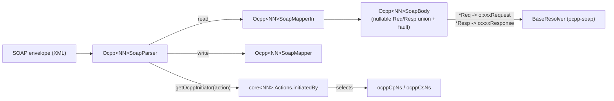

# SOAP Layer Guidelines

## Purpose

The `soap` layer implements OCPP-S (SOAP/XML) for a given protocol version: it binds the shared
envelope machinery in `ocpp-soap` to a version's `core` model, providing the body type,
namespace-aware parser, and read/write XML mappers needed to exchange SOAP envelopes on the
wire.

Instances: `ocpp-1-5-soap`, `ocpp-1-6-soap`. SOAP is a 1.x-only transport in
this toolkit — there is **no `ocpp-2-0-soap`**; OCPP 2.0.1 is OCPP-J only.



## Common Patterns

- **Separate in/out mappers.** Reading and writing use two distinct `internal object` XmlMappers
  built on the shared `OcppSoapMapper` — `Ocpp<NN>SoapMapperIn` for reading, `Ocpp<NN>SoapMapper`
  for writing — each with its own mix-in set. A serialisation-only fix belongs in the writer; a
  deserialisation-only fix belongs in the reader. Fixing the wrong one silently affects only one
  direction of traffic, with no compiler or test signal pointing you at the mistake.
- **`Ocpp<NN>SoapBody` is an exhaustive nullable-field union.** It declares one nullable property
  per supported operation's Req and Resp, plus a `fault` property; Jackson picks whichever
  element is present in the envelope. Property *names* are load-bearing: `BaseResolver` in
  `ocpp-soap` derives the outbound XML element name from them (`*Req` → `o:xxxRequest`, `*Resp`
  → `o:xxxResponse`). A missing or misnamed field does not fail to compile — it makes the
  operation silently unparseable (a null where a value was expected).
- **`Actions` enum drives initiator resolution and namespace selection.** `getOcppInitiator`
  resolves the action through the version's `core<NN>.model.common.enumeration.Actions`, whose
  `initiatedBy` determines which of the two namespaces (`ocppCpNs` or `ocppCsNs`) is stamped on
  an outbound message.
- **Faults are values, not exceptions.** Parse failures are captured with
  `parseSoapFaulted(soap, e) { Ocpp<NN>SoapBody(fault = it) }` rather than thrown. Malformed XML
  therefore surfaces as a fault payload flowing through the normal body type, not as a thrown
  exception the caller must catch.
- **Asymmetric request/response fault handling.** `getRequestBodyContent` converts a `SoapFault`
  into a fault request (`.isA<SoapFault> { it.toFaultReq() }`); `getResponseBodyContent` does
  not perform the equivalent conversion. This asymmetry is deliberate — do not "fix" it to be
  symmetric without checking `ocpp-soap`'s fault contract first.
- **Same escape hatches as the `json` layer**: `ignoredNullRestrictions` and `forcedFieldTypes`,
  version-typed (e.g. `Ocpp16IgnoredNullRestriction`, `Ocpp16ForcedFieldType`) from the matching
  `core<NN>` module's `DeserializeOptions.kt`, applied in `applyDeserializerOptions` before
  mapping.

## Naming Conventions

- **Package**: `com.izivia.ocpp.soap<NN>` (e.g. `com.izivia.ocpp.soap16`)
- **Parser class**: `Ocpp<NN>SoapParser`, extends `OcppSoapParserImpl`
- **Body class**: `Ocpp<NN>SoapBody`
- **Mapper objects**: `Ocpp<NN>SoapMapperIn` (read), `Ocpp<NN>SoapMapper` (write) — both
  `internal object` `XmlMapper`s
- **Module name**: `ocpp-<version>-soap` (e.g. `ocpp-1-6-soap`)
- **Test class**: `Ocpp<NN>SoapParserTest`

## File Organization

```
ocpp-<version>-soap/
└── src/
    ├── main/kotlin/com/izivia/ocpp/soap<NN>/
    │   ├── Ocpp<NN>SoapParser.kt  # namespaces, mapper wiring, body-content dispatch
    │   ├── Ocpp<NN>SoapBody.kt    # one nullable Req/Resp pair per operation + fault
    │   └── Ocpp<NN>SoapMapper.kt  # Ocpp<NN>SoapMapperIn + Ocpp<NN>SoapMapper, mix-ins
    └── test/kotlin/com/izivia/ocpp/soap<NN>/
        └── Ocpp<NN>SoapParserTest.kt  # round-trips representative envelopes
```

Three files, flat package — no sub-packaging by operation. This keeps the Req/Resp union in
`Ocpp<NN>SoapBody` auditable as a single exhaustive list.

## Adding an Operation

1. Ensure the operation has a `core<NN>` model (Req/Resp) and an `Actions` entry with
   `initiatedBy` set correctly.
2. Add nullable `xxxReq` and `xxxResp` properties to `Ocpp<NN>SoapBody`, named precisely — the
   names drive `BaseResolver`'s outbound element naming, so a typo produces a silent null rather
   than a build failure.
3. Add the Jackson mix-in(s) for the new type(s) to `Ocpp<NN>SoapMapperIn` and
   `Ocpp<NN>SoapMapper`, in whichever direction(s) they're needed — remember these are two
   separate mapper instances.
4. Wire the new operation into `Ocpp<NN>SoapParser`'s body-content dispatch.
5. Add a round-trip case to `Ocpp<NN>SoapParserTest` — the nullable-union body means a missing
   binding produces a silent null instead of a test/compile failure, so a dedicated test case is
   the only real safety net.

## Common Dependencies

- **`ocpp-soap`**: shared `OcppSoapParserImpl`, `OcppSoapMapper`, `BaseResolver`, `SoapFault`
  envelope/fault machinery.
- **Jackson XML** (`XmlMapper`): SOAP body (de)serialisation.
- The matching `core<NN>` module: models, `Actions` enum, `DeserializeOptions.kt`.

## Per-Version Namespaces (Wire-Level Version Discriminator)

The namespace pair is the first thing to check when a peer rejects a message as unrecognised —
it is effectively the SOAP layer's version discriminator on the wire:

| Version | `ocppCpNs` (charge-point-hosted) | `ocppCsNs` (central-system-hosted) |
|---------|-----------------------------------|-------------------------------------|
| 1.2     | `urn://Ocpp/Cp/2010/08/`          | `urn://Ocpp/Cs/2010/08/`            |
| 1.5     | `urn://Ocpp/Cp/2012/06/`          | `urn://Ocpp/Cs/2012/06/`            |
| 1.6     | `urn://Ocpp/Cp/2015/10/`          | `urn://Ocpp/Cs/2015/10/`            |

## A CSMS cannot initiate over SOAP

`OcppSoapServerTransport.sendMessageClass` is an unimplemented `TODO`. A CSMS built on
`ocpp-transport-soap` can receive and answer Charging-Station-initiated calls, but cannot push an
unsolicited request (e.g. RemoteStartTransaction) to a charge point. Both 1.5 and 1.6 are affected,
since the limitation is in the shared transport rather than in a version's `soap` module.

## Domain-Specific Variations

Each version's `soap` module follows the shape above; namespaces, operation counts, and
mix-in sets differ per version. See:
- [../ocpp-1-5-soap/CLAUDE.md](../ocpp-1-5-soap/CLAUDE.md)
- [../ocpp-1-6-soap/CLAUDE.md](../ocpp-1-6-soap/CLAUDE.md)
- [../ocpp-soap/CLAUDE.md](../ocpp-soap/CLAUDE.md) — envelope model, `BaseResolver`, fault handling
